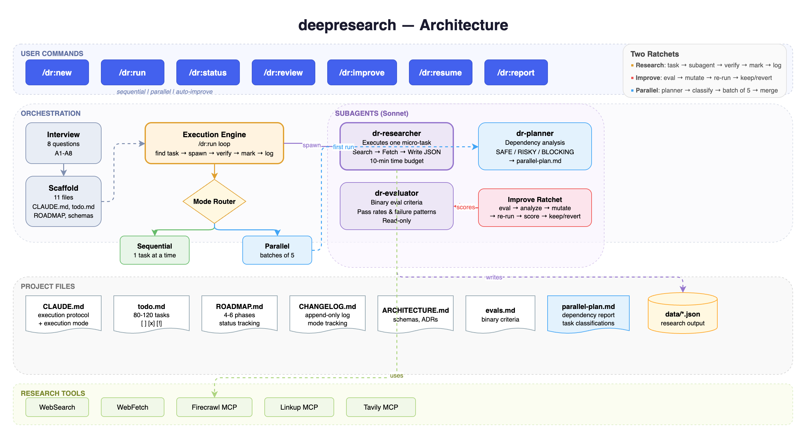

# deepresearch

Autonomous multi-session research for Claude Code.



## Install

```bash
git clone https://github.com/HadiFrt20/deepresearch.git ~/.claude/skills/deepresearch
cd ~/.claude/skills/deepresearch && ./setup
```

## Quick start

```
/dr:new        — answer 8 questions, get a full project scaffold
/dr:run        — autonomous execution (hours, not minutes)
/dr:status     — progress dashboard
/dr:review     — validate data quality
/dr:resume     — pick up where you left off
/dr:improve    — self-improving research loop
/dr:report     — synthesize findings
```

## Execution modes

By default, /dr:run executes tasks sequentially. You can change this.

During /dr:new, you pick a default mode (sequential, sequential-auto-improve, parallel, parallel-auto-improve).

Override at runtime:
- `/dr:run`                        — uses the project default
- `/dr:run sequential`             — one task at a time
- `/dr:run sequential-auto-improve` — sequential + auto-improve at phase boundaries
- `/dr:run parallel`               — batches of 5 within a phase (requires dependency analysis first)
- `/dr:run parallel-auto-improve`  — parallel + auto-improve at phase boundaries

### Dependency analysis for parallel mode

Before the first parallel run in a project, /dr:run spawns a dr-planner subagent
that reads todo.md, ROADMAP.md, and ARCHITECTURE.md to classify each task as
SAFE, RISKY, BLOCKING, or CROSS-PHASE. It writes `.research/parallel-plan.md` with
a recommendation (parallelize fully, partial, sequential only, or mixed). You
review the plan, then re-run `/dr:run parallel` to proceed.

This prevents race conditions on shared output files and ensures tasks that
depend on each other don't run simultaneously.

### Auto-improve at phase boundaries

In the auto-improve modes, /dr:run automatically runs the /dr:improve ratchet
between phases: score current phase data, analyze failures, mutate researcher,
re-run sample, keep or revert. The next phase starts with the improved
researcher. All version history is saved to `.research/eval-history/`.

## Why this exists

You prompt Claude Code with "research X." It does a surface pass in 20 minutes and stops.

deepresearch adds the scaffolding: decomposed tasks, subagent isolation, verification, portable memory, and a self-improvement loop that makes the researcher better over time.

## Inspired by

- GSD — spec-driven scaffolding (interview, specs, tasks, execute, verify)
- gstack — role-based skills (one command per job, opinionated defaults)
- Karpathy autoresearch — the ratchet loop (run, score, keep/revert, repeat)
- Self-improving skills — eval, mutate, re-run, keep if better

## How it works

Two ratchets:

1. **Research ratchet** (`/dr:run`): task, subagent, verify output, mark done/fail, log, next
2. **Improvement ratchet** (`/dr:improve`): eval, analyze failures, mutate researcher, re-run, score, keep or revert

The researcher subagent's instructions are the trainable parameter. Eval pass rate is the metric.

## Commands

| Command | What it does |
|---------|-------------|
| `/dr:new` | Interview (8 questions) then generate full project scaffold |
| `/dr:run` | Execute tasks autonomously (supports sequential, parallel, auto-improve modes) |
| `/dr:status` | Dashboard: task counts, phase status, data completeness |
| `/dr:review` | Audit data quality against schemas |
| `/dr:resume` | Find where you left off and continue |
| `/dr:improve` | Self-improvement loop: eval, mutate, re-run, keep/revert |
| `/dr:report` | Synthesize all findings into final deliverable |

## Tool selection

During `/dr:new`, you choose your research tools:

- **Native** (WebSearch + WebFetch) — works out of the box, no setup needed
- **Firecrawl MCP** — recommended for deep research (search, scrape, crawl, map)
- **Linkup MCP** — search with structured extraction
- **Tavily MCP** — search optimized for AI agents
- **Multiple** — combine any of the above

Your choice configures CLAUDE.md and the researcher subagent automatically. You can change tools later by editing the Tool priority section in CLAUDE.md.

## Generated project structure

After running `/dr:new`, your project looks like this:

```
your-project/
├── CLAUDE.md                          # execution protocol
├── todo.md                            # 80-120 atomic tasks
├── .research/
│   ├── PROJECT.md                     # research brief
│   ├── ARCHITECTURE.md                # schemas and methodology
│   ├── ROADMAP.md                     # 4-6 phases with status
│   ├── CHANGELOG.md                   # append-only execution log
│   ├── evals.md                       # binary eval criteria
│   ├── verify.sh                      # progress verification script
│   ├── parallel-plan.md               # dependency analysis (parallel mode)
│   └── eval-history/
│       ├── baseline.json              # initial eval scores
│       ├── iteration-1.json           # scores after improvement
│       └── researcher-v1.md           # researcher version history
├── .claude/agents/
│   ├── dr-researcher.md               # project-local researcher
│   ├── dr-evaluator.md                # project-local evaluator
│   └── dr-planner.md                  # dependency analysis (parallel mode)
├── prompts/
│   └── session-*.md                   # per-session prompts
├── data/
│   └── *.json                         # research output files
└── output/
    └── final-report.md                # synthesized deliverable
```

## Self-improvement

`/dr:improve` treats the researcher subagent's instructions as the trainable parameter and eval pass rate as the metric. Same pattern Karpathy used on train.py, applied to research prompts. Binary eval criteria, no vibes.

The loop:
1. Score current data against eval criteria
2. Analyze failure patterns (which criteria fail, why)
3. Mutate the researcher (1-3 concrete instruction changes)
4. Re-run a sample of failed tasks
5. Score again
6. Keep if better, revert if not

Run `/dr:improve --cycles 3` for multiple rounds.

## Update

```bash
cd ~/.claude/skills/deepresearch && git pull && ./setup
```

## Uninstall

```bash
cd ~/.claude/skills/deepresearch && ./uninstall
```

To also remove the repo:
```bash
rm -rf ~/.claude/skills/deepresearch
```

## Requirements

- Claude Code 2.1.88+
- Max plan recommended for auto mode and long sessions
- Firecrawl MCP recommended but not required

## License

MIT
